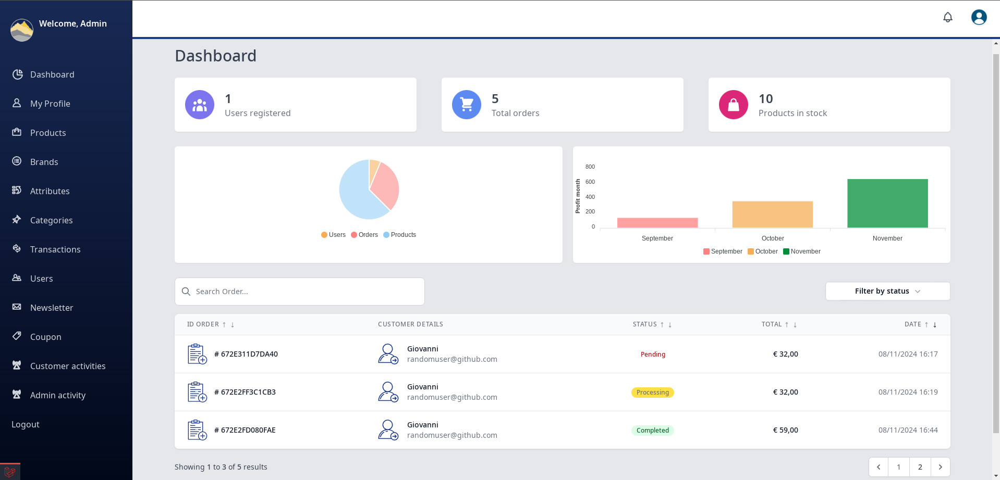
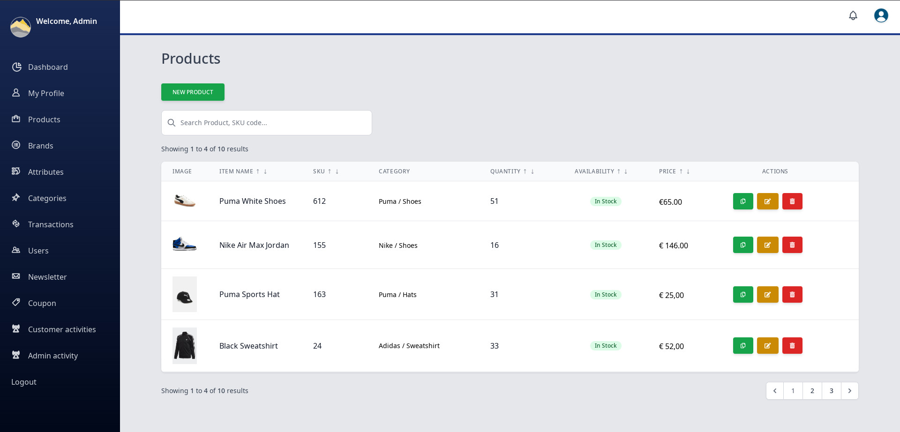

 

## E-commerce Laravel Full-Stack - DASHBOARD ADMIN PANEL FOR ECOMMERCE

## FEATURES

Fully functional E-commerce website front-end and back-end.

Using Tailwind CSS, Alpine JS and Livewire as an Admin panel for the website management and product search.

LOG Monitoring Access on Admin & Customers.
    
Intelligent searching mechanism for products.
    
Awesome Cart package that uses session with Coupon Discount application.
    
An artisan command to seed the database with all necessary dummy data.
    
Different user roles and privileges with multiple authentication guard 
 
Categories, tags and price filtering for easier search for products.
    
And much more features.

### START (LARAVEL WEB SITE) LOCAL DEV [LIVEWIRE E-COMMERCE PLATFORM]

    composer update && composer dump-autoload
    npm install --force && npn run dev
    php artisan storage:link
    php artisan key:generate && php artisan serve

### IMPORT DEFAULT DATABASE  [LIVEWIRE E-COMMERCE PLATFORM]
    Location Path Database --> database/store/livewire.sql

### POPULATE DATABASE WITH FAKE DATA [LIVEWIRE E-COMMERCE PLATFORM]

    php artisan migrate:fresh --seed

## ADMIN LOGIN CREDENTIALS

    username: jimipulsar@github.com
    password: 123456

## .ENV EXAMPLE

    Check .env.example to set up application

